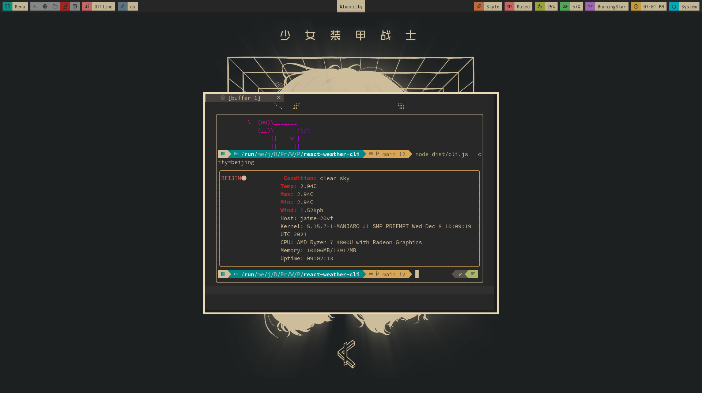

# weather-fetch

> This README is automatically generated by [create-ink-app](https://github.com/vadimdemedes/create-ink-app)


## Usage
```bash
git clone https://github.com/jaimetrovoada/weather-fetch.git
cd weather-fetch
```
### arguments
```bash
--city: optional, if not provided will default to London
--unit: optional, if not provided will default to Metric
```
### running with npm start
```bash
npm start -- --city=[city-name] --unit=[metric or imperial]
```
### build and then running
```bash
npm run build
node dist/cli.js --city=[city-name] --unit=[metric or imperial]
```

# screenshot

